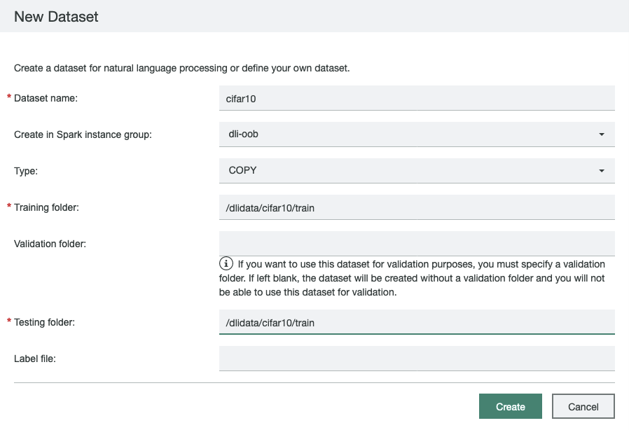

## Supported-Scenarios (To-Be-Discussed):
**This is Placeholder Table ONLY, goal is to have non-image-classification sample, suggestion is welcome**
| Framework/Interface| DLI UI | DLI RestAPI | BYOF RestAPI|
|------------------- | :-------:|:--------------:| --|
|Image Classification PyTorch Resnet (GPU)       |X  | X  |	|
|Time Series Keras LSTM - TF as backend (GPU)| X	| | 	
|Image Classification PyTroch Resnet (CPU)  |	|	|	|
|Time Series Keras LSTM - TF as backend (CPU)| 	| | 
	

## README Template
#### Table of contents

1. [Scenarios](#Scenarios)
2. [Pre-requisites](#Pre-req)
3. [Instructions](#Instruction)
4. [Conclusion](#Conclusion)

## Scenarios
This asset details the process of performing a basic computer vision image classification example using the Deep Learning Impact (DLI) functionality within Watson Machine Learning Accelerator.  

In this asset, you will learn how to:
 - update open source model to accelerate your training with DLI functionality
 - accelerate your training and score the inference model with DLI functionality 
 

## Pre-requisites
- Watson Machine Learning Accelerator is  installed & configured.    Please refer to [Knowledge Center](https://www.ibm.com/support/knowledgecenter/SSFHA8_1.2.2/wmla_install.html) for further details.
- Upload following assets to your Watson Machine Learning Accelerator cluster:
  - dataset url
  - model url
  - **any artifacts/assets link**

## Instructions
Adopt this format for UI workflow: -> [https://github.com/IBM/wmla-learning-path/blob/master/tutorials-ui/01_classify_images_tensorflow.ipynb](https://github.com/IBM/wmla-learning-path/blob/master/tutorials-ui/01_classify_images_tensorflow.ipynb)

**Steps with Screen Shots,  expects to include content such as what's the model doing or how to analyze results**

-   [Import dataset](https://render.githubusercontent.com/view/ipynb?commit=1910deb04f14faf327eb983b6e56b24f25ae046b&enc_url=68747470733a2f2f7261772e67697468756275736572636f6e74656e742e636f6d2f49424d2f776d6c612d6c6561726e696e672d706174682f313931306465623034663134666166333237656239383362366535366232346632356165303436622f7475746f7269616c732d75692f30315f636c6173736966795f696d616765735f74656e736f72666c6f772e6970796e62&nwo=IBM%2Fwmla-learning-path&path=tutorials-ui%2F01_classify_images_tensorflow.ipynb&repository_id=258578830&repository_type=Repository#Import-dataset)

1. Download the [CIFAR-10 python version](https://www.cs.toronto.edu/~kriz/cifar.html).
2. Once downloaded, prepare the dataset by following these steps:
3. Untar the downloaded dataset. This will yield a folder called "cifar-10-batches-py".
4. Create two new directories: one called "train", and the other called "test".
5. Copy the cifar-10-batches-py directory to both the train and test folders created in the previous step.
6. Import the dataset to be used with the model. Do the following:
7. From the cluster management console, navigate to Workload > Deep Learning.
8. Select the Dataset tab and click New.
9. Select the Any option.
10. Select COPY  in the "type" drop down menu. In the "training folder" text box, input the full path to the "train" directory created in a previous step. Likewise, in the "testing folder" text box, input the full path to the "test" directory.

&nbsp;

&nbsp;

11. Select the dataset name and the Spark instance group for this dataset and click Create.

-   [Build the model](https://render.githubusercontent.com/view/ipynb?commit=1910deb04f14faf327eb983b6e56b24f25ae046b&enc_url=68747470733a2f2f7261772e67697468756275736572636f6e74656e742e636f6d2f49424d2f776d6c612d6c6561726e696e672d706174682f313931306465623034663134666166333237656239383362366535366232346632356165303436622f7475746f7269616c732d75692f30315f636c6173736966795f696d616765735f74656e736f72666c6f772e6970796e62&nwo=IBM%2Fwmla-learning-path&path=tutorials-ui%2F01_classify_images_tensorflow.ipynb&repository_id=258578830&repository_type=Repository#Build-the-model)
-   [Tune Hyper-parameter](https://render.githubusercontent.com/view/ipynb?commit=1910deb04f14faf327eb983b6e56b24f25ae046b&enc_url=68747470733a2f2f7261772e67697468756275736572636f6e74656e742e636f6d2f49424d2f776d6c612d6c6561726e696e672d706174682f313931306465623034663134666166333237656239383362366535366232346632356165303436622f7475746f7269616c732d75692f30315f636c6173736966795f696d616765735f74656e736f72666c6f772e6970796e62&nwo=IBM%2Fwmla-learning-path&path=tutorials-ui%2F01_classify_images_tensorflow.ipynb&repository_id=258578830&repository_type=Repository#Tune-hyper-parameter)
-   [Run Training](https://render.githubusercontent.com/view/ipynb?commit=1910deb04f14faf327eb983b6e56b24f25ae046b&enc_url=68747470733a2f2f7261772e67697468756275736572636f6e74656e742e636f6d2f49424d2f776d6c612d6c6561726e696e672d706174682f313931306465623034663134666166333237656239383362366535366232346632356165303436622f7475746f7269616c732d75692f30315f636c6173736966795f696d616765735f74656e736f72666c6f772e6970796e62&nwo=IBM%2Fwmla-learning-path&path=tutorials-ui%2F01_classify_images_tensorflow.ipynb&repository_id=258578830&repository_type=Repository#Run-training)
-   [Inspect Training Run](https://render.githubusercontent.com/view/ipynb?commit=1910deb04f14faf327eb983b6e56b24f25ae046b&enc_url=68747470733a2f2f7261772e67697468756275736572636f6e74656e742e636f6d2f49424d2f776d6c612d6c6561726e696e672d706174682f313931306465623034663134666166333237656239383362366535366232346632356165303436622f7475746f7269616c732d75692f30315f636c6173736966795f696d616765735f74656e736f72666c6f772e6970796e62&nwo=IBM%2Fwmla-learning-path&path=tutorials-ui%2F01_classify_images_tensorflow.ipynb&repository_id=258578830&repository_type=Repository#Inspect-training-run)
-   [Create an inference model](https://render.githubusercontent.com/view/ipynb?commit=1910deb04f14faf327eb983b6e56b24f25ae046b&enc_url=68747470733a2f2f7261772e67697468756275736572636f6e74656e742e636f6d2f49424d2f776d6c612d6c6561726e696e672d706174682f313931306465623034663134666166333237656239383362366535366232346632356165303436622f7475746f7269616c732d75692f30315f636c6173736966795f696d616765735f74656e736f72666c6f772e6970796e62&nwo=IBM%2Fwmla-learning-path&path=tutorials-ui%2F01_classify_images_tensorflow.ipynb&repository_id=258578830&repository_type=Repository#Create-an-inference-model)
-   [Test it out](https://render.githubusercontent.com/view/ipynb?commit=1910deb04f14faf327eb983b6e56b24f25ae046b&enc_url=68747470733a2f2f7261772e67697468756275736572636f6e74656e742e636f6d2f49424d2f776d6c612d6c6561726e696e672d706174682f313931306465623034663134666166333237656239383362366535366232346632356165303436622f7475746f7269616c732d75692f30315f636c6173736966795f696d616765735f74656e736f72666c6f772e6970796e62&nwo=IBM%2Fwmla-learning-path&path=tutorials-ui%2F01_classify_images_tensorflow.ipynb&repository_id=258578830&repository_type=Repository#Test-it-out)

## Conclusion
