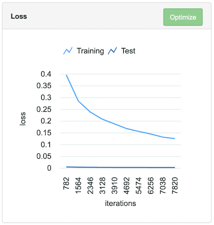
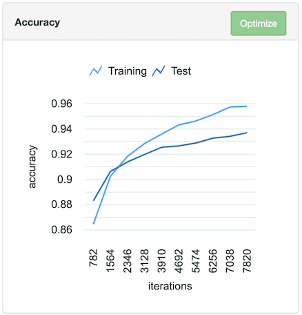

## Supported-Scenarios (To-Be-Discussed):
**This is Placeholder Table ONLY, goal is to have non-image-classification sample, suggestion is welcome**
| Framework/Interface| DLI UI | DLI RestAPI | BYOF RestAPI|
|------------------- | :-------:|:--------------:| --|
|Image Classification PyTorch Resnet (GPU)       |Aug 28  | Aug 28  |	|
|Time Series Keras LSTM - TF as backend (GPU)| To be investigated	|  To be investigated| 	
|Image Classification PyTroch Resnet (CPU)  |	|	|	|
|Time Series Keras LSTM - TF as backend (CPU)| 	| | 
	

## README Template
#### Table of contents

1. [Scenarios](#Scenarios)
2. [Pre-requisites](#Pre-req)
3. [Instructions](#Instruction)
4. [Conclusion](#Conclusion)


## Scenarios
This asset details the process of performing a basic computer vision image classification example using the Deep Learning Impact (DLI) functionality within Watson Machine Learning Accelerator.  

In this asset, you will learn how to:
 - update open source model to accelerate your training with DLI functionality
 - accelerate your training and score the inference model with DLI functionality 
 

## Pre-requisites
- Watson Machine Learning Accelerator is  installed & configured.    Please refer to [Knowledge Center](https://www.ibm.com/support/knowledgecenter/SSFHA8_1.2.2/wmla_install.html) for further details.
- Upload following assets to your Watson Machine Learning Accelerator cluster:
  - [CIFAR-10 python version](https://www.cs.toronto.edu/~kriz/cifar.html)
  - [PyTorch Resnet Model](https://github.com/IBM/wmla-assets/raw/master/dli-learning-path/datasets/pytorch_resnet.zip)
  - **any artifacts/assets link**

## Instructions

###   [Import dataset]
1. Upload the [CIFAR-10 python version](https://www.cs.toronto.edu/~kriz/cifar.html) to your Watson Machine Learning Accelerator cluster.
2. Once upload, prepare the dataset by following these steps:
3. Untar the downloaded dataset. This will yield a folder called "cifar-10-batches-py".
4. Create two new directories: one called "train", and the other called "test".
5. Copy the cifar-10-batches-py directory to both the train and test folders created in the previous step.
6. Import the dataset to be used with the model. Do the following:
7. From the cluster management console, navigate to Workload > Deep Learning.
8. Select the Dataset tab and click New.
9. Select the Any option.
10. Select COPY  in the "type" drop down menu. In the "training folder" text box, input the full path to the "train" directory created in a previous step. Likewise, in the "testing folder" text box, input the full path to the "test" directory.
11. Select the dataset name and the Spark instance group for this dataset and click Create.

&nbsp;

&nbsp;
&nbsp;

###   Build the model

Before upload an model to the WMLA platform, you need to modify your model with DLI programming APIs, which enables you to manage the model settings via the WMLA GUI (eg. datasource, optimizer, lr policy, epoch, batchsize, etc.) 

To access the DLI programming API doc, complete the following steps:
1. From the cluster management console, navigate to Workload > Deep Learning.
2. In the upper right, move the mouse to the question mark
3. Cick "Deep Learning Python API"
4. For pytorch model, click "pth_parameter_mgr" to view full available programming API list.

&nbsp;
Here's steps to update raw pytoch model into a WMLA model, note that you could refer to ```main_raw.py``` and ```main.py``` as before and after:
1. Import the WMLA python API for pytorch
```python
import pth_parameter_mgr
```

2. Parse the parameters, which is passed by WMLA at runtime:
```python
def main(model_type, pretrained = False):
    parser = argparse.ArgumentParser(description='PyTorch Resnet Cifar10 Example')
    parser.add_argument('--train_dir', type=str, default='', help='input the path of model checkpoint file path')
    parser.add_argument('--weights', type=str, default='', help='input the path of initial weight file')

    args, unknown = parser.parse_known_args()
    ......
```

Now you can use ```args.train_dir``` in your code to save model checkpoints and results, the trainning result fils can be downloaded from GUI later if you want. use ```args.weights``` to load pretrained model as your training start point, the initial weight files can be specified or uploaded when submmiting jobs from GUI. See section "Run Training" for details. For example, you could save final training result as below:

```python
torch.save(model.state_dict(), "args.train_dir + "/model_epoch_final.pth")
```

&nbsp;
3. Replace hard-coded model configuration with corresponding APIs, the API will load user defined settings durning the runtime. For example:

To read train/test dataset that we created in step 1:
```python
train_data_dir = pth_parameter_mgr.getTrainData(False)   # set false if you only want to return the root directory instead of a full file list
test_data_dir = pth_parameter_mgr.getTestData(False)

train_dataset = torchvision.datasets.CIFAR10(root=train_data_dir, train=True, download=False, transform = transform_train)
test_dataset = torchvision.datasets.CIFAR10(root=test_data_dir, train=False, download=False, transform = transform_test)
```

To get data batch size:
```python
train_loader = torch.utils.data.DataLoader(train_dataset, batch_size=pth_parameter_mgr.getTrainBatchSize(), shuffle=True, **kwargs)
test_loader = torch.utils.data.DataLoader(test_dataset, batch_size=pth_parameter_mgr.getTestBatchSize(), shuffle=True, **kwargs)
```

To get epoch:
```python
epochs = pth_parameter_mgr.getEpoch()
```

To get optimizer:
```python
optimizer = pth_parameter_mgr.getOptimizer(model)
```

To get learning rate:
```python
scheduler = pth_parameter_mgr.getLearningRate(optimizer)
```

4. To support upload pretrained weight file when submitting training, add below code:

```python
def getWeightFile(args):    
    initial_weight_dir_str = args.weights.strip() 

    if not initial_weight_dir_str:
        return ""

    if not os.path.exists(initial_weight_dir_str):
        return ""

    input_weight_dir = os.path.expanduser(initial_weight_dir_str)
    allfiles = glob.iglob(input_weight_dir + '/*.*')
    weightfiles = [wt_f for wt_f in allfiles if wt_f.endswith(".pth")]

    weightfile = ""

    for wtfile in weightfiles:
        if wtfile.startswith("model_epoch_final"):
            return wtfile

        weightfile = wtfile

    return weightfile
    
weightfile = getWeightFile(args)
    if weightfile:
        print ("Initial weight file is " + weightfile)
        model.load_state_dict(torch.load(weightfile, map_location=lambda storage, loc: storage))
```

5. To inspect Training progress (etc, loss/acc) from GUI during the training, add ouputs for DLinsights service to retrieve (See section "Inspect Training Run" for details). For example:
```python
print ("Iteration " + str(completed_batch) + ": tag train_accuracy, simple_value " + str(correct*1.0/total))
print ("Iteration " + str(completed_batch) + ": tag train_loss, simple_value " + str(train_loss*1.0/(batch_idx+1)))

print ("Iteration " + str(completed_batch) + ": tag test_accuracy, simple_value " + str(test_acc/100.0))
print ("Iteration " + str(completed_batch) + ": tag test_loss, simple_value " + str(test_loss))
```


###   [Upload the model](https://render.githubusercontent.com/view/ipynb?commit=1910deb04f14faf327eb983b6e56b24f25ae046b&enc_url=68747470733a2f2f7261772e67697468756275736572636f6e74656e742e636f6d2f49424d2f776d6c612d6c6561726e696e672d706174682f313931306465623034663134666166333237656239383362366535366232346632356165303436622f7475746f7269616c732d75692f30315f636c6173736966795f696d616765735f74656e736f72666c6f772e6970796e62&nwo=IBM%2Fwmla-learning-path&path=tutorials-ui%2F01_classify_images_tensorflow.ipynb&repository_id=258578830&repository_type=Repository#Build-the-model)

To upload the sample model, complete the following steps to upload all the model files to the server.:

1. From the cluster management console, navigate to Workload > Deep Learning.
2. Navigate to the Models tab and click New.
3. Click Add Location and input the required fields, including: PyTorch as the framework and the upload location of the model files.
4. Click Next and input the required fields for the model. IMPORTANT: All training engines are available with this model so you can select any of the training engine options.

###   [Tune Hyper-parameter](https://render.githubusercontent.com/view/ipynb?commit=1910deb04f14faf327eb983b6e56b24f25ae046b&enc_url=68747470733a2f2f7261772e67697468756275736572636f6e74656e742e636f6d2f49424d2f776d6c612d6c6561726e696e672d706174682f313931306465623034663134666166333237656239383362366535366232346632356165303436622f7475746f7269616c732d75692f30315f636c6173736966795f696d616765735f74656e736f72666c6f772e6970796e62&nwo=IBM%2Fwmla-learning-path&path=tutorials-ui%2F01_classify_images_tensorflow.ipynb&repository_id=258578830&repository_type=Repository#Tune-hyper-parameter)

shall we need this section?

###   [Run Training](https://render.githubusercontent.com/view/ipynb?commit=1910deb04f14faf327eb983b6e56b24f25ae046b&enc_url=68747470733a2f2f7261772e67697468756275736572636f6e74656e742e636f6d2f49424d2f776d6c612d6c6561726e696e672d706174682f313931306465623034663134666166333237656239383362366535366232346632356165303436622f7475746f7269616c732d75692f30315f636c6173736966795f696d616765735f74656e736f72666c6f772e6970796e62&nwo=IBM%2Fwmla-learning-path&path=tutorials-ui%2F01_classify_images_tensorflow.ipynb&repository_id=258578830&repository_type=Repository#Run-training)

To start a training run with the sample model, complete the following steps:
1. From the cluster management console, navigate to Workload > Deep Learning.
2. Select the newly created model and click Train to start a training run configuration.
3. input the required fields and complete "Start Training".

&nbsp;
[TODO: provide the pre-trained model download link, in ibm cloud maybe?] 
&nbsp;

If you want to start your training based on a pretrained model, you could: 
1. download the example pre-trained model and place it on server (eg. /dlidata/resnet/checkpoint)
2. Specify the location of a folder containing weight files when submitting training
Or:
1. download the example pre-trained model to you local host
2. Click "Browse" and select the weight file when submmitting training 

&nbsp;

&nbsp;
&nbsp;

###   [Inspect Training Run]

Inspect the training status with below steps when the job is running or finished:
1. From the cluster management console, navigate to Workload > Deep Learning.
2. Select the model and click the Training tab to view all training jobs.
3. Click the training jobs you want to inspec and observe the train/test accuracy/loss for each epochs

&nbsp;

&nbsp;
&nbsp;

###   [Create an inference model]

To start an inference job with the trained sample model, complete the following steps:
1. From the cluster management console, navigate to Workload > Deep Learning.
2. Navigate to the Models tab and click on the sample model that you trained.
3. Select the Training tab, and select the finished training run that you want to use as an inference model and click Create Inference Model.

###   [Test it out]

To test an inference model, complete the following steps:
1. From the cluster management console, navigate to Workload > Deep Learning.
2. Select the inference model and click Test.
3. Select the files that you want to predict and click Start Test.
4. After the inference job is finished, click on the job to see prediction results.

&nbsp;

&nbsp;
&nbsp;

The CIFAR-10 dataset consists of 60000 32x32 colour images in 10 classes. The label value 0-9 are mapping to ['airplan', 'automobile', 'bird', 'cat', 'deer', 'dog', 'frog', 'horse', 'ship', 'truck']
&nbsp;

&nbsp;
&nbsp;

