# IBM Watson Studio Local 2.0 Base Installation

##  Installation/Configuration of Watson Studio Local 2.0 

Download the IBM Watson Studio Local Trial here: https://www-01.ibm.com/marketing/iwm/iwm/web/download.do?source=mrs-ibmdselt&pageType=urx&S_PKG=code

You can automate the Watson Studio Local installation by creating a configuration file named wdp.conf that will complete all of the parameters. Before you run the installation, the file must be in the same directory as the installation package, and the directory must be in the installer path.

##  Installation Requirements

To access the Watson Studio Local install, use https://<hostname>:31843.
        
Before you install Watson Studio Local, ensure that your servers meet all of the system requirements.

Watson Studio Local requires at least three virtual machines as master nodes for high availability. The installation remotely configures the rest of the nodes from the first master node. You can use any number of virtual machines as worker nodes. The first three worker nodes take on the storage role in the cluster. If you install a three-node cluster, the master nodes can take on the role of the worker nodes.

You can also use two virtual machines as proxy nodes to provide high availability for the load balancing capability of the cluster. Separate proxy nodes to reduce the workload on the master nodes. If you do not specify proxy nodes, the first two master nodes assume the role of the proxy nodes.

##  Installation by Configuration File

To install Watson Studio Local by configuration file, complete the following steps:

1. SSH into the master node (master-1) of your cluster as root: ssh root@MASTER_1_IP.

2. Download the installation package, Watson Studio base add-on, and all module TAR files to the first master node of your dedicated Watson Studio Local cluster.

3. Move the installation package to the installer files partition you created (you cannot install from any path that is mounted as /), and make the installation package executable by entering chmod +x <installpkg>.

4. In the same installer files partition, create sub-directory modules (for example, /ibm/modules), and move all module TAR files to it. Later, the installer will automatically detect these modules and prompt for confirmation to install them.

   Tip

   To deploy modules after the base installation has already been deployed, copy the TAR files to the /ibm/modules directory, and then go to /ibm/InstallPackage/components and run ./deploy.sh <path-of-addon>.
        
5. If you already have a wdp.conf file, put it in the same directory as the installation package. To generate a new wdp.conf template, run the installation with parameter --get-conf-user (for a sudo user) or --get-conf-key (for an SSH key).

   For a six or more node installation, no further parameters are required.
   
   For a three, four, or five node wdp.conf template, add the --three-nodes parameter.

6. After wdp.conf is generated, you can customize the parameters. Ensure that every field is completed. Insert the required parameters in the wdp.conf as detailed in the following table:

   Restriction

   In a six-node configuration, you must have only three master nodes. You can have a minimum of three worker nodes, but add as many as you need.

Table 1. wdp.conf required parameters for six-node installation

Field name | Field value
--- | ---
virtual_ip_address_1 | The IP address of your first virtual network.
virtual_ip_address_2 | The IP address of your second virtual network.
ssh_key | The directory of where your SSH key is located. If you do not know where it is, try looking in the root folder or contact support.
ssh_port | Your SSH port number. The default is always 22, which can be customized to your preference.
master_node_1* | The IP address of your first master node.
master_node_path_1 | The name of the installation path in your first master node.
master_node_2* | The IP address of your second master node.
master_node_path_2 | The name of the installation path in your second master node.
master_node_3* | The IP address of your third master node.
master_node_path_3 | The name of the installation path in your third master node. Note: You can only have up to three master nodes.
worker_node_1* | The IP address of your first worker node.
worker_node_path_1 | The name of the installation path in your first worker node.
worker_node_2* | The IP address of your second worker node.
worker_node_path_1 | The name of the installation path in your second worker node.
worker_node_3* | The IP address of your third worker node. Note: You have as many worker nodes as you'd like and you can give them any name to your preference, but the minimum required for a six-node configuration is three worker nodes.
nfs_server | Optional: The IP address of the NFS server. Required only if you are doing an NFS set up.
nfs_dir | Optional: The name of the installation path in your NFS server. Required only if you are doing an NFS set up.
worker_node_data_1 | Optional: The name of the data path in your first worker node. Required only if you use GlusterFS storage in the Watson Studio Local setup.
worker_node_data_2 | Optional: The name of the data path in your first worker node. Required only if you use GlusterFS storage in the Watson Studio Local setup.
worker_node_data_2 | Optional: The name of the data path in your first worker node. Required only if you use GlusterFS storage in the Watson Studio Local setup.

Table 2. wdp.conf required parameters for three-node installation

Field name | Field value
--- | ---
virtual_ip_address_1 | The IP address of your first virtual network.
virtual_ip_address_2 | The IP address of your second virtual network.
ssh_key | The directory of where your SSH key is located. If you do not know where it is, try looking in the root folder or contact support.
ssh_port | Your SSH port number. The default is always 22, which can be customized to your preference.
node_1* | The IP address of your first node.
node_path_1 | The name of the installation path in your first node.
node_2* | The IP address of your master node.
node_path_2 | The name of the installation path in your second node.
node_3* | The IP address of your master node.
node_path_3 | The name of the installation path in your third node. Note: You have as many worker nodes as you'd like and you can give them any name to your preference, but the minimum required for a six-node configuration is three worker nodes.
worker_node_data_1 | Optional: The name of the data path in your first worker node. Required only if you use GlusterFS storage in the Watson Studio Local setup.
worker_node_data_2 | Optional: The name of the data path in your first worker node. Required only if you use GlusterFS storage in the Watson Studio Local setup.
worker_node_data_2 | Optional: The name of the data path in your first worker node. Required only if you use GlusterFS storage in the Watson Studio Local setup.

   The names of these nodes do not have to be exactly master_node_1 or worker_node_1 and such. It can be of any name to your preference as long as there are the required number of nodes.

   For more details on optional nodes configuration, see below:

   To add additional nodes, you can append parameters using the following example:

   worker_node_4=x.x.x.x
   worker_node_path_4=/ibm
   worker_node_5=x.x.x.x
   worker_node_path_5=/ibmCopy

   For a cluster with six or more nodes, you can label worker nodes as Watson Machine Learning nodes by adding the following lines to the wdp.conf file:

   worker_node_label_value_1="wml-common"
   worker_node_label_value_2="wml-common"Copy

   If you want to use proxy nodes to reduce the workload on the master nodes, you must add at least two proxy node entries to the wdp.conf file. For example:

   proxy_node_1=IP_address
   proxy_node_path_1=installation_partition
   proxy_node_docker_disk_1=docker_raw_disk
   proxy_node_2=IP_address
   proxy_node_path_3=installation_partition
   proxy_node_docker_disk_2=docker_raw_diskCopy

   If you do not specify proxy nodes, the first two master nodes assume the role of proxy nodes.

7. Verify that your directory structure is correct:

   ```
   /ibm
      |--- installationpackage.tar
      |--- modules
         |--- watson-studio-base.tar (and other add-ons and extensions)
      |--- wdp.conf
   ```
    
8. Run the installation package by going into the installer's directory and enter the command ./<installer file name>. The installer detects the wdp.conf file and prompts you whether you want to use this file for the configuration.

9. Agree to the terms and conditions.

The installation runs step-by-step and might take a long time. If an installation step fails, review the log files and contact IBM Software Support. The installation log file is located in the mounted directory that you used for the installer. To avoid unexpected issues, make sure to resolve the issue in the log before you retry or skip the step.

# IBM Watson Machine Learning 2.0 Add-on Installation

Assumption : In order to deploy IBM Watson Machine Learning 2.0 it requires IBM Watson Studio Local 2.0 base installation to be already deployed on the cluster. 
So the below steps outlined are followed based on this assumption.

##  Installation/Configuration of Watson Machine Learning 2.0 

1. Download the IBM Watson Machine Learning add-on Evaluation software (wml_module.tar) from the <IBM Software Repository>. This downloadable package is around 16GB in size and requires IBM ID to download.

2. You can download the Watson Machine Learning software add-on package to the /ibm/InstallPackage/modules directory. On successful download the file exists as /ibm/InstallPackage/modules/wml_module.tar  

3. Now we are all set deploy the IBM Watson Machine Learning add-on package. Go to /ibm/InstallPackage/components directory and execute the below command

        cd /ibm/InstallPackage/components
        ./deploy.sh /ibm/InstallPackage/modules/ wml_module.tar
   It asks for License acceptance and once you accept the license terms the above deployment might take around 30 minutes to complete.

4. Post successful IBM Watson Machine Learning add-on package, execute following command to verify if the add-on package deployment was successful 
        
        helm list --tls | grep wml 
   The above command will list the WML package with deployment Status (if its Successful it would display DEPLOYED).
   


#  IBM Watson Machine Learning Accelerator 1.2.1 Installation

## Steps

#### Step 1. Download IBM Watson Machine Learning Accelerator 1.2.1 Evaluation


* Download the IBM Watson Machine Learning Accelerator Evaluation software from the IBM Software Repository. This is a 4.9 GB download and requires an IBM ID.

#### Step 2. Read and follow "Set up your system" and make sure your system meets all the perquisites before you proceed to install Watson Machine Learning Accelerator 1.2.1. 

* DLI_SHARED_FS is supported in NFS3. You would need to export DLI_SHARED_FS when installing Watson Machine Learning Accelerator 1.2.0.
* DLI_RESULT_FS and DLI_DATA_FS are supported in NFS4. You would need to export DLI_RESULT_FS and DLI_DATA_FS when installing Watson Machine Learning Accelerator 1.2.1.

#### Step 3. Install Watson Machine Learning Accelerator 1.2.1 using the instructions given in the IBM Knowledge Center. 

#### Step 4. Download and install manadatory iFix for Watson Machine Learning Accelerator -> https://www-945.ibm.com/support/fixcentral/swg/selectFixes?parent=ibm%7EOther%20software&product=ibm/Other+software/IBM+PowerAI+Enterprise&release=1.2.0&platform=All&function=all


#### Step 5. Configuration of Watson Machine Learning Accelerator with Watson Studio token authentication 

Get DLI_JWT_SECRET_KEY from Watson Studio Local and save DLI_JWT_SECRET_KEY to a shared file system accessible across all nodes. You would need to export DLI_JWT_SECRET_KEY file path when installing Watson Machine Learning Accelerator 1.2.1.

1. `$> wget --no-check-certificate https://<watson_studion_local_host>:<ws_port>/auth/jwtcert`
2. `$> openssl x509 -pubkey -in jwtcert -noout >ws_local.pem`
3. `$> source /opt/ibm/spectrumcomputing/profile.platform`
3.	Edit dlpd.conf file ($EGO_TOP/dli/conf/dlpd/dlpd.conf) and update DLI_JWT_SECRET_KEY value to the location of newly generated ws_local.pem file

     *	Copy and paste DLI_JWT_SECRET_KEY to /shared_nfs4/icp4d_key.pem
     *  `# chmod 777 /shared_nfs4/icp4d_key.pem`
4. restart dlpd service
```
$> source /opt/wmla/ego_top/profile.platform
$> egosh user logon -u Admin -x Admin
$> egosh service stop dlpd
$> sleep 5
$> egosh service start dlpd
```

#### Step 6.  Creation of OS users on all hosts.
* a) Create an OS user by name wml-user which will be used to create the SIG. 
* Ex:  `useradd -m -u 20005 wml-user`

* b) Create an OS user for every WSL user who are going to submit the training jobs from WSL/WML. In this tutorial we will use default WSL/WML user "admin"
* Ex: `useradd -m -u 20006 admin`

* You may create other similar users corresponding to the other WSL users


#### Step 7. Ensure that GPU is enabled for deep learning workloads. If you do not have GPU enabled, enable GPU by running one of these scripts on the master host command line interface:

* To run with user interaction: 
    ```
    # $EGO_TOP/conductorspark/2.3.0/etc/gpuconfig.sh enable
    ```
* To run without user interaction:
    ```
    # $EGO_TOP/conductorspark/2.3.0/etc/gpuconfig.sh enable --quiet -u <username> -x <password>
    ```
* Navigate to the Watson Machine Learning Accelerator GUI and logon.

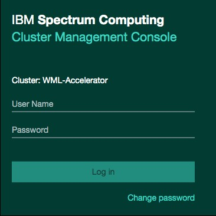

#### Step 8. Create GPU resource group.

* Click on “Resources”> “Resource Planning (Slot)” > “Resource Groups”

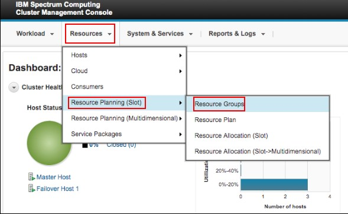

* Click on “Global Actions”> “Create a Resource Group”


* Fill in the “Resource group name”, “Advanced Formula” to “ngpus” and then click “Create”

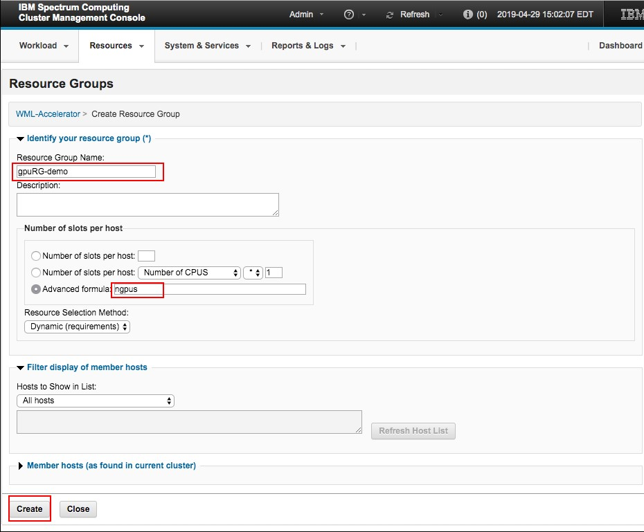

#### Step 9. Create wml-ig.

* Click on “Workload”> “Spark” > “Spark Instance Groups”


* Click on “Create a Spark instance Group”

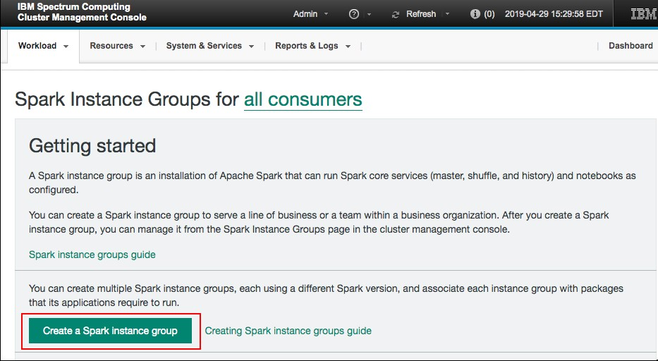

* Click on “Templates”

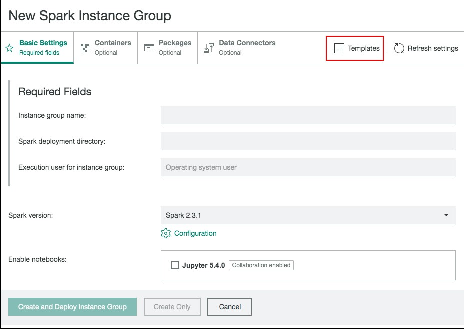

* Click on “wmla-ig-template-2-3-1 use”


* Fill in “Instance group name” to “wml-ig”, “Spark deployment directory”, “Execution user for instance group” to “wml-user”. Ensure “Spark deployment directory” is accessible to “wml-user” across all nodes.

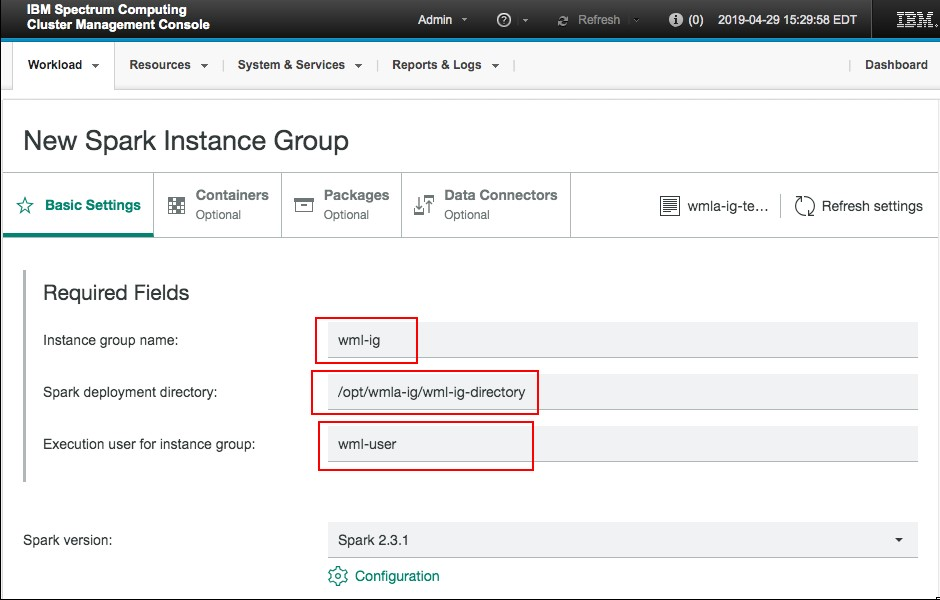

* Select the GPU resource group you just created in step 8 of this tutorial and click “Create and Deploy Instance Group”

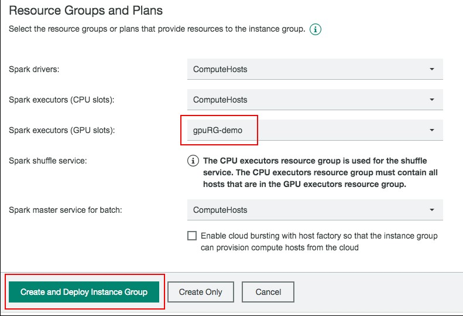

#### Step 10: Create wml-ig-edt.

* Click on “Workload”> “Spark” > “Spark Instance Groups”


* Click on "New"


* Click on “Templates”


* Click on “wmla-ig-edt-template-2-3-1 use”

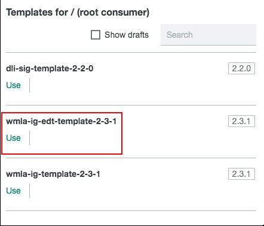

* Fill in “Instance group name” to “wml-ig-edt”, “Spark deployment directory”, “Execution user for instance group” to “wml-user”. Ensure “Spark deployment directory” is accessible to “wml-user” across all nodes.   Please make sure the parent directory "/opt/wmla-ig" pre-exists and "wml-user" has write access to this parent directory.

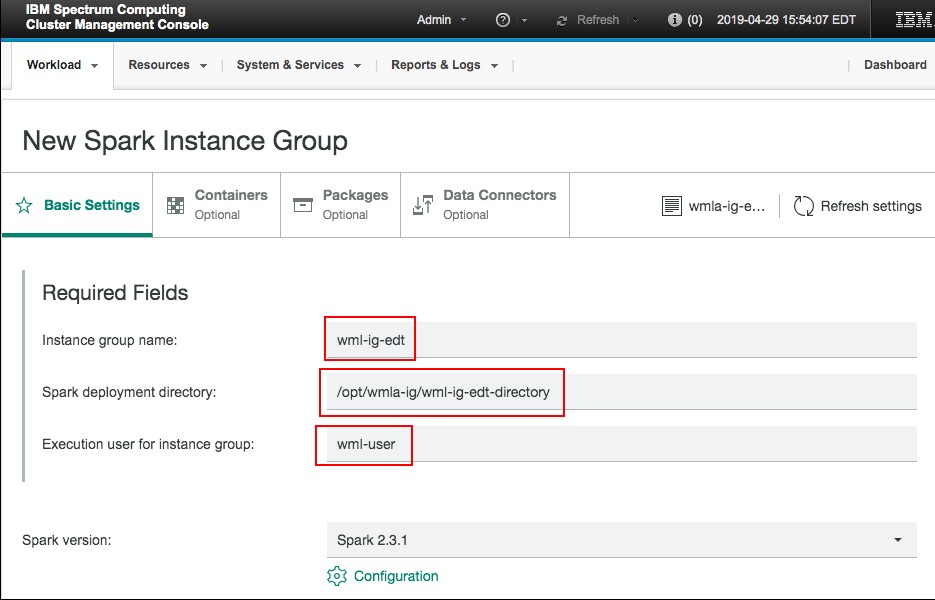

* Select the GPU resource group you just created in step 8 of this tutorial and click “Create and Deploy Instance Group”


#### Step 11. Create EGO user corresponding to all OS user created in step 6 of this tutorial

* Click on “System & Services” > “Users” > “Accounts” 

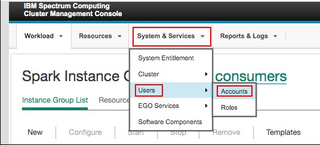

* Click on “Global Actions” > “Create New User Account”

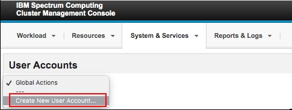

* Fill in the “User Name”, “Password” and click create

* Create users for each of wml-user and the WSL users defined in Step 6 

#### Step 12. Step Assign the created EGO user consumer role for wml-ig and wml-ig-edt

* Click on “System & Services” > “Users” > “Roles” 

* Click on “Consumer User” > “wml-user” > “wml-ig” and “wml-ig-edt” and click “Apply”


* Similary assign the role for each of the WSL users created in Step 6

#### Step 13a. Set the variable METRICS_STREAMING=Y in $EGO_CONFDIR/dli/conf/dlpd/dlpd.conf

#### Step 13b. Enable EGO_ENABLE_CONSUMER_LEVEL_EXCLUSIVE.  In Master host command line interface, do the following:

* Open the $EGO_CONFDIR/ego.conf file for editing.
* `EGO_ENABLE_CONSUMER_LEVEL_EXCLUSIVE=Y`
* Save your changes
* Restart the cluster:
    ```
    egosh service stop all
    egosh ego shutdown
    egosh ego start all
    ```
#### Step 14. Enable the following so that for non-EDT jobs, if a job allocates 4 GPUs then it allocates the whole host exclusively. Configure wml-ig and wml-ig-edt GPU resource plan.
 
* Click on “Resource”> “Resource Group Planning (Slot)” > “Resource Plan”


* Configure resource plan for wml-ig and wml-ig-edt as following:


There is known issue -> https://www.ibm.com/support/knowledgecenter/en/SSFHA8_1.2.0/release_note_s/known_issues_limitations.html

  ```
Cluster fails to respond when saving changes to a Spark instance group that was created using the wmla-ig-template-2-3-1 template
    When configuring a Spark instance group and setting EGO_ENABLE_CONSUMER_LEVEL_EXCLUSIVE=Y in the ego.conf file, the following error message is displayed when saving your changes: Error 500: javax.servlet.ServletException: The cluster is not responding.

    To resolve this issue, try saving the resource group plan again.
  ```


#### Step 15. Set “Reclaim Grace Period” for wml-ig and wml-ig-edt.

* Click on “Resources”> “Consumers”

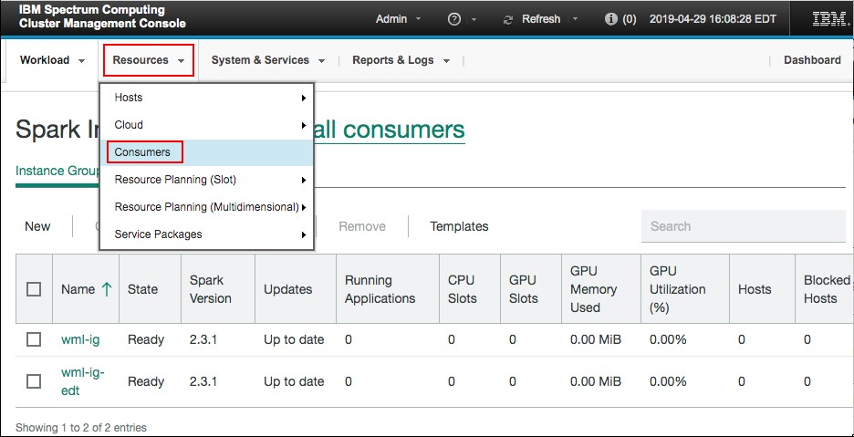

* Set “Reclaim Grace Period” to “596 hours” in consumer level for wml-ig and for each child consumer belonging to wml-ig as shown below:


* Set “Reclaim Grace Period” to “120 seconds” in consumer level for wml-ig-edt as shown below:

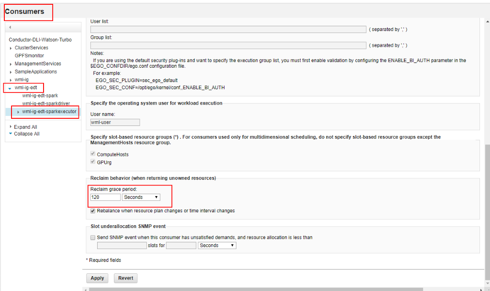

#### Step 16. Configure GPU mode to exclusive across all nodes. In command line interface run:

* `nvidia-smi -c 1` to set GPU mode to exclusive process mode
* `nvidia-smi` command to ensure GPU mode is set to exclusive process mode
* restart ego

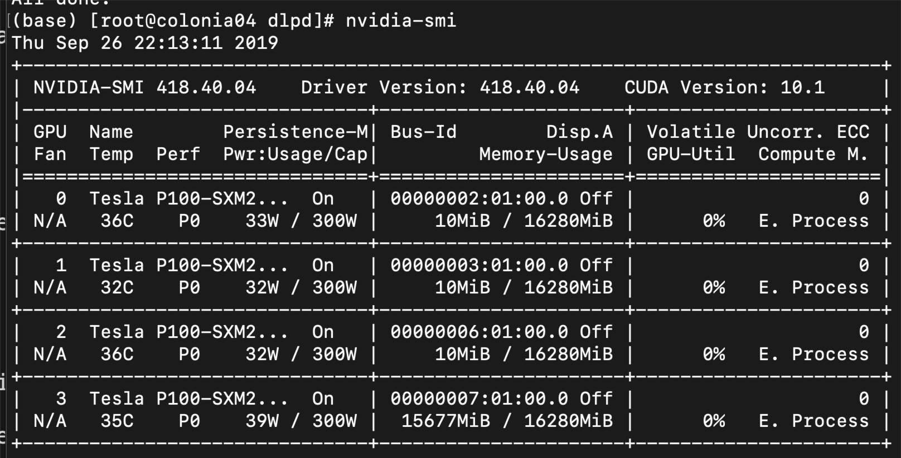

#### Step 17:   Connect Watson Machine Learning with Watson Machine Learning Accelerator

1. Access  Watson Machine Learning host (via SSH) on Master node

2. `$> cd /ibm/InstallPackage/components/modules/wml`

3. run `$> ./updateWMLClusterdetails.sh <wmla_host> <wmla_ port> <wmla_default_ig> <wmla_default_edt_ig> <wml_external host adress>`
  where:
  * <wmla _host> – is the ip address that can be accessed from WML cluster in WMLA cluster master node
  * <wmla_ port> - the port exposed by WMLA for DLI rest API. Usually this is 9243
  * <wmla_default_ig> - the instance group name created in WMLA for regular jobs. Usually this value is wml-ig
  * <wmla_default_edt_ig> - ihe instance group created in WMLA for Elastic Distributed Training jobs. Usually this value is wml-ig-edt
  * <wml_external_host> - The external host name or IP address of WML that can be accessed from WMLA.(This is the same as Watson Studio host name)


      Example:
      ```
      /updateWMLClusterdetails.sh 10.15.112.32 9243 wml-ig wml-ig-edt 169.224.121.54
      ```
      or:
      ```
      ./updateWMLClusterdetails.sh some-wmla-host.ibm.com 9243 wml-ig wml-ig-edt some-ws-host.ibm.com
      ```


